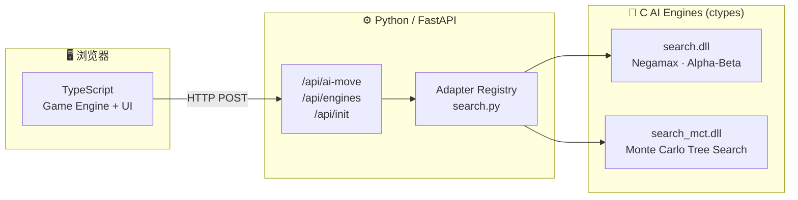
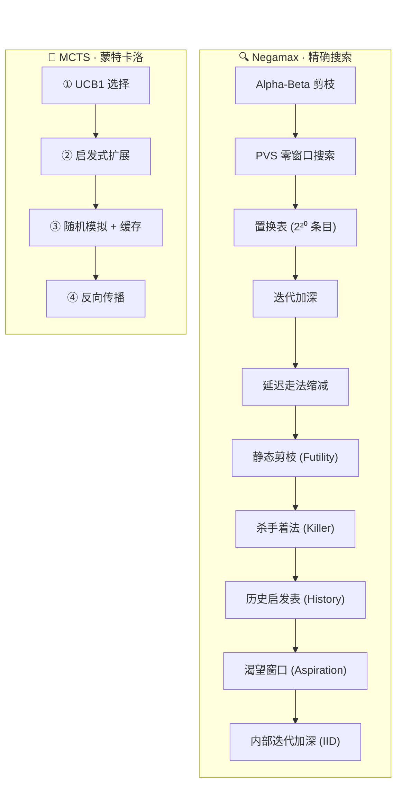
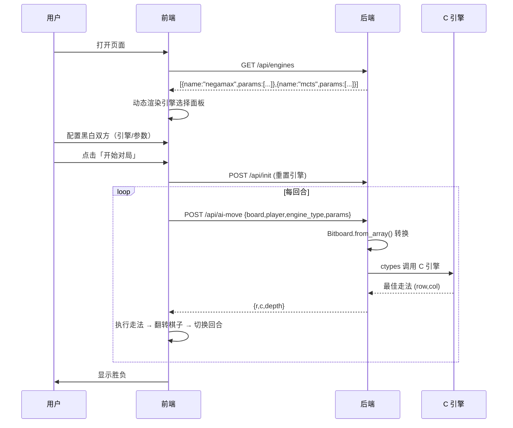

# 🎮 Reversi（黑白棋）

> 一个功能完整的黑白棋（Othello）对战平台 — 支持人机/人人/AI 对战，C 语言 AI 引擎 + Python 后端 + TypeScript 前端，即开即用。



---

## 快速开始

| 方式 | 适合 | 步骤 |
|---|---|---|
| 🚀 **打包版** | 即开即用，无需安装 | 解压 `dist/Reversi.zip` → 双击 `Reversi.exe` |
| 🛠 **源码版** | 开发者，需改代码 | `cd backend && pip install -r requirements.txt` → `python main.py` |

> 启动后自动打开浏览器访问 `http://127.0.0.1:8000`。
>
> **注意**：打包版 Windows 专供（Nuitka `--standalone`）；源码版跨平台 — Linux/macOS 需重新编译 C 引擎（见[编译指南](#编译-ai-引擎)），Windows 下已预编译好 `.dll`。

---

## 特性矩阵

| | 说明 |
|---|---|
| 🎮 **对战模式** | 人人 / 人机 / AI vs AI，黑白双方独立配置 |
| 🧠 **双引擎** | Negamax（精确搜索）+ MCTS（蒙特卡洛），一键切换 |
| 🔌 **即插即用** | 前端自动发现引擎 → 动态渲染配置面板，加引擎**只改一个文件** |
| ⚡ **位棋盘** | 64-bit 位运算，走法生成与翻转亚毫秒级 |
| 🎨 **现代 UI** | 绿色棋盘 + 状态提示 + 参数表单自动适配 |
| 📊 **基准测试** | 5 个历史版本对照 + MCTS，量化每项优化收益 |

---

## 项目结构

```
Reversi/
├── backend/
│   ├── main.py                 # FastAPI 入口（CORS + 静态文件 + 自动打开浏览器）
│   ├── requirements.txt        # Python 依赖
│   ├── core/
│   │   └── board.py            # Bitboard 棋盘引擎（位运算走法生成/翻转/合法性）
│   ├── ai/
│   │   ├── search.py           # 引擎注册表 + Adapter 模式（加引擎改这里）
│   │   ├── search.c            # Negamax C 引擎（Alpha-Beta + PVS + TT）
│   │   ├── search.dll          # ── 编译产物（Windows）
│   │   ├── search_mct.c        # MCTS C 引擎（UCB1 + 位棋盘 + 缓存随机模拟）
│   │   ├── search_mct.dll      # ── 编译产物（Windows）
│   │   ├── benchmark.py        # 性能基准测试脚本
│   │   └── v0~v3_*_debug.*    # 历史版本（用于对照测试）
│   ├── api/
│   │   └── routes.py           # API 路由（零引擎特化代码）
│   └── static/
│       └── index.html          # 构建产物（单文件部署）
├── frontend/
│   ├── package.json            # Vite + TypeScript
│   ├── vite.config.js          # vite-plugin-singlefile → 单 HTML 输出
│   └── src/
│       ├── main.ts             # 游戏主循环 & 回合调度
│       ├── core/game.ts        # 前端游戏逻辑（走法/翻转/计分）
│       ├── ui/board.ts         # 棋盘 UI（64 格 + 事件委托）
│       ├── ui/msg.ts           # 状态栏 & 比分 & 弹窗提示
│       ├── ui/choose.ts        # 开局配置面板（动态渲染引擎参数）
│       └── api/ai.ts           # AI 通信模块（泛化 EngineConfig）
└── docs/
    ├── engine-registry-design.md   # 引擎注册机制设计文档
    ├── adding-ai-engine.md         # 添加 AI 引擎指南
    ├── BENCHMARK_REPORT.md         # 各版本评测报告
    └── backlog.md                  # 待办事项
```

---

## AI 引擎

### 引擎对比



| 维度 | Negamax | MCTS |
|---|---|---|
| **算法** | Negamax + Alpha-Beta + PVS | 蒙特卡洛树搜索 + UCB1 |
| **搜索方式** | 确定性，遍历博弈树 | 随机，统计模拟 |
| **评估** | 位置权重 + 行动力 | 随机终局胜负统计 |
| **优势** | 中盘精确，计算力强 | 探索性强，无评估函数 |
| **可调参数** | 深度 `1–64` 或 时间 `10ms–10min` | 模拟次数 `100–10M` |
| **适用阶段** | 全盘，尤其中后盘 | 开局、复杂局面 |
| **输出** | 最佳走法 + 估值 | 最多访问的走法 |

### 优化历程（Benchmark 实测）

| 版本 | 技术栈 | d=10 平均耗时 | 相对上层加速 | 与 v4 走法一致率 |
|---|---|---|---|---|
| v0 | 纯 Minimax | 5.198s | — | 75% |
| v1 | + Alpha-Beta | 7.240ms | **×720** | 81% |
| v2 | + 置换表 | 5.807ms | ×1.2 | 81% |
| v3 | + LMR/Killer/History/IID（含调试） | 10.110ms | ×0.6* | 79% |
| v4 | v3 去调试输出（当前引擎） | 8.462ms | — | 100% |

> \* v3 因调试输出开销，在固定深度下略慢于 v2；在**限时搜索**模式中 LMR 等可多搜 2–3 层，优势显著。

### MCTS 性能

| 迭代次数 | 耗时 | 走法稳定性 |
|---|---|---|
| 5,000 | ~23ms | 低（开局走法波动大） |
| 20,000（默认） | ~98ms | 中 |
| 100,000 | ~446ms | 高（终局几乎一致） |

---

## 使用说明

### 启动流程



### 配置面板

黑白双方可独立配置：

| 配置项 | 说明 |
|---|---|
| **URL 留空** | 该方由人类点击落子 |
| **URL 填入** `/api/ai-move` | 使用远端/本机 AI |
| **引擎下拉** | Negamax / MCTS |
| **参数** | 由引擎动态决定（深度/时间/迭代次数） |

> 面板完全由 `GET /api/engines` 响应驱动，添加新引擎**前端零改动**。

---

## API 参考

### `GET /api/engines`

返回已注册引擎的元信息（名称、标签、参数 Schema）。

<details>
<summary>响应示例</summary>

```json
[
  {
    "name": "negamax",
    "label": "Negamax (Alpha-Beta)",
    "params": [
      {
        "key": "strategy",
        "type": "select",
        "options": [
          {"value": "fixed_depth", "label": "固定深度"},
          {"value": "time_limit", "label": "限时搜索"}
        ],
        "label": "搜索模式"
      },
      {
        "key": "depth",
        "type": "int",
        "default": 14,
        "min": 1,
        "max": 64,
        "label": "搜索深度",
        "show_if": {"strategy": "fixed_depth"}
      },
      {
        "key": "time_limit_ms",
        "type": "int",
        "default": 3000,
        "min": 10,
        "max": 600000,
        "label": "时间上限 (ms)",
        "show_if": {"strategy": "time_limit"}
      }
    ]
  },
  {
    "name": "mcts",
    "label": "MCTS (蒙特卡洛)",
    "params": [
      {
        "key": "iterations",
        "type": "int",
        "default": 20000,
        "min": 100,
        "max": 10000000,
        "label": "模拟次数"
      }
    ]
  }
]
```
</details>

### `POST /api/ai-move`

统一走法计算端点。由 `engine_type` 分发到对应适配器。

| 字段 | 类型 | 说明 |
|---|---|---|
| `board` | `int[][]` | 8×8 数组（1=黑, -1=白, 0=空） |
| `player` | `int` | 当前方：1=黑, -1=白 |
| `engine_type` | `string` | 引擎名：`"negamax"` \| `"mcts"` |
| `params` | `object` | 引擎参数（见上方 Schema） |

<details>
<summary>请求/响应示例</summary>

```json
// 请求 — Negamax 固定深度
{
  "board": [[0,0,0,...], ...],
  "player": 1,
  "engine_type": "negamax",
  "params": { "strategy": "fixed_depth", "depth": 14 }
}

// 请求 — MCTS
{
  "board": [[0,0,0,...], ...],
  "player": -1,
  "engine_type": "mcts",
  "params": { "iterations": 20000 }
}

// 响应
{ "r": 2, "c": 3, "depth": 14 }
```
</details>

### `POST /api/init`

重置引擎状态（清空置换表 / 重新播种随机数）。

```json
// 请求
{ "engine_type": "negamax" }

// 响应
{ "status": "success", "message": "引擎 'negamax' 已重置" }
```

---

## 扩展引擎


添加新引擎只需修改 `backend/ai/search.py` 一个文件 — 编写 Adapter 类 + 一行注册。详见 [`docs/adding-ai-engine.md`](docs/adding-ai-engine.md)。

### Adapter 契约

```python
class MyAdapter:
    spec = {
        "name": "my_engine",
        "label": "我的引擎",
        "params": [
            {"key": "param1", "type": "int", "default": 10, "min": 1, "max": 100, "label": "参数1"},
        ],
    }

    @staticmethod
    def init():
        """重置引擎状态"""
        pass

    @staticmethod
    def search(p_bb: int, o_bb: int, params: dict, player_value: int) -> tuple[int, int, object]:
        """返回 (move_index, score, extra)"""
        pass
```

---

## 编译 AI 引擎

### Windows（MinGW）

```bash
cd backend/ai
gcc -O3 -static -shared -o search.dll search.c          # Negamax
gcc -O3 -static -shared -o search_mct.dll search_mct.c  # MCTS
```

### Linux / macOS

```bash
cd backend/ai
gcc -O3 -static -shared -fPIC -o search.so search.c
gcc -O3 -static -shared -fPIC -o search_mct.so search_mct.c
```

> `-static` 必须保留，否则 Python 运行时可能找不到 `libgcc` 相关 DLL。`search.py` 自动按平台选择 `.dll` 或 `.so`。

---

## 技术栈

| 层 | 技术 | 备注 |
|---|---|---|
| **后端框架** | FastAPI (Python 3.10+) | uvicorn 异步服务器 |
| **AI 引擎** | C (GCC, `-O3`) | ctypes 调用，位棋盘加速 |
| **引擎架构** | Registry + Adapter 模式 | `/api/engines` 自描述，前后端解耦 |
| **前端** | TypeScript + Vite | vanilla DOM（无框架依赖） |
| **构建** | vite-plugin-singlefile | 单 HTML 输出，零外部 CSS/JS |
| **样式** | 原生 CSS | 内联，绿色棋盘主题 |

---

## 开发

```bash
# 前端开发（热重载）
cd frontend && npm install && npm run dev

# 前端构建 → backend/static/index.html
npm run build

# 运行基准测试
cd backend/ai && python benchmark.py
```

---

## 许可证

MIT
