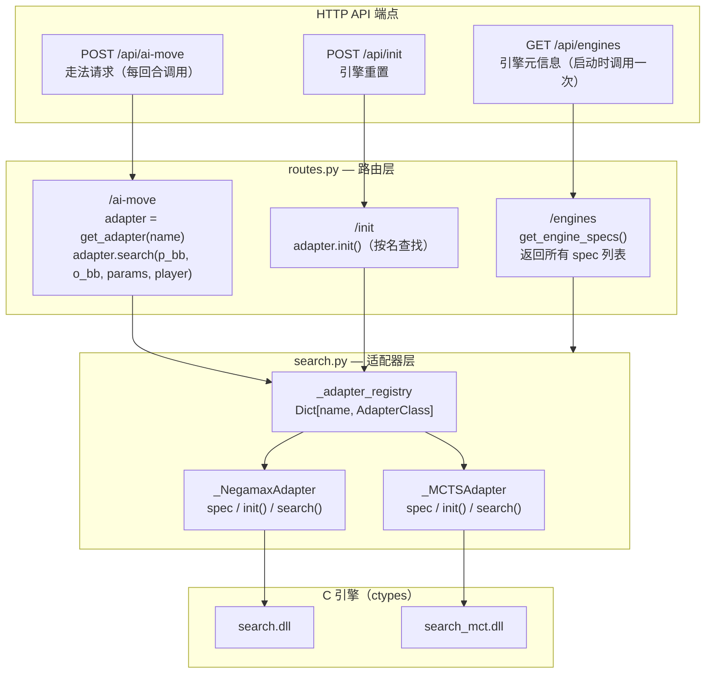

# 添加自定义 AI 引擎指南

本文档面向希望为黑白棋项目接入新算法 / 新模型 / 新引擎的开发者。

**P1 重构后，加一个新引擎只需改一个文件（`ai/search.py`），前端和后端路由零改动。**

---

## 架构总览



**核心设计：** 前端通过 `GET /api/engines` 获取引擎列表 + 参数 schema，**动态渲染整个选择面板**。路由层通过 `get_adapter(name).search(...)` 一行分发，不包含任何引擎特定分支。

**加新引擎只需一个文件：**

| 层级 | 文件 | 改什么 |
|------|------|--------|
| **Python 适配** | `ai/search.py` | 写 Adapter 类 + 一行注册 |
| ~~路由分发~~ | ~~`api/routes.py`~~ | **零改动**（自动分发） |
| ~~前端 UI~~ | ~~`src/api/ai.ts` + `src/ui/choose.ts`~~ | **零改动**（动态渲染） |

---

## 第一章：C 引擎层（编写 DLL）

如果你的算法用 C/C++ 实现，需要编译成动态链接库供 Python 调用。纯 Python 实现可跳过本章。

### 1.1 命名规范

文件命名：`search_<name>.c`
DLL 导出前缀：`<name>_`
编译产物：`search_<name>.dll`（Windows）或 `search_<name>.so`（Linux）

### 1.2 导出函数接口

至少需要一个返回最佳走法的主函数：

```c
/**
 * 搜索接口
 * board:    8×8 数组，0=空 1=黑 2=白
 * player:   当前轮到谁 1=黑 2=白
 * out_x/y:  输出落子坐标
 * param:    引擎特有参数（迭代次数等）
 */
DLLEXPORT void my_engine_search(int board[8][8], int player,
                                int *out_x, int *out_y, int param);
```

建议额外导出的辅助函数：

| 函数 | 用途 |
|------|------|
| `void my_engine_init(void)` | 初始化（随机种子、清空缓存） |
| `int get_legal_moves_list(...)` | 获取合法走法列表 |
| `int is_game_over_dll(...)` | 检查游戏是否结束 |
| `void get_score_dll(...)` | 获取双方棋子数 |

### 1.3 棋盘编码约定

**DLL 层使用 `0=空 / 1=黑 / 2=白`**（Python 层使用 `0 / 1 / -1`，注意转换）。

坐标映射：`board[r][c]` → 索引 `idx = r * 8 + c` → 位棋盘 `1ULL << idx`。

### 1.4 编译

```bash
# Windows
gcc -shared -O3 -static -o search_<name>.dll search_<name>.c

# Linux
gcc -shared -O3 -static -fPIC -o search_<name>.so search_<name>.c
```

`-static` 是必要的，否则 Python 运行时可能找不到 `libgcc_s_seh-1.dll`。

### 1.5 代码格式规范

与 `search.c` 保持一致：

- **2 空格缩进**（不是 4 空格）
- 文件头用 `/** ... */`，段分隔用 `/* ===...=== */`（68 字符宽）
- 注释统一用 `/* */`，不用 `//`
- `typedef uint64_t uint64;` 类型别名
- 使用 `__builtin_popcountll` / `__builtin_ctzll`
- 大括号与函数签名同行

---

## 第二章：Python 适配层（`ai/search.py`）— **唯一需要改的文件**

### 2.1 要做什么

写一个 Adapter 类，满足三个约定，然后注册到 `_adapter_registry`：

| 约定项 | 说明 |
|--------|------|
| `spec`（类属性 dict） | 引擎元信息 — name、label、params schema |
| `init()` | 初始化引擎（每局开始前调用） |
| `search(p_bb, o_bb, params, player_value)` | 执行搜索，返回 `(move, score, extra)` |
| `get_best_move(depth, p_bb, o_bb)` | 固定深度搜索（向后兼容，返回 `(move, score)`） |
| `get_best_move_timed(ms, p_bb, o_bb)` | 限时搜索（向后兼容，返回 `(move, score, depth)`） |
| `search_with_iterations(n, p_bb, o_bb, player)` | 迭代搜索（向后兼容，返回 `(move, score)`） |

> 后三个 backward-compat 方法不是必须的，但如果你的 Adapter 要兼容调用 `SearchEngine.get_best_move()` 的直接调用方，建议实现。`search()` 是新架构的主要入口。

### 2.1.1 `search()` 签名详解

```python
@staticmethod
def search(player_bb: int, opponent_bb: int,
           params: dict, player_value: int = 1
           ) -> Tuple[Optional[int], int, int]:
    """
    Parameters:
        player_bb    — 己方位棋盘（uint64）
        opponent_bb  — 对方位棋盘（uint64）
        params       — 自由键值对，{"depth": 14}、{"iterations": 20000} 等
        player_value — 1=黑方, -1=白方（前端原始值）

    Returns:
        move   — 棋盘索引 0-63，None 表示无合法走法
        score  — 评估分（正值=己方有利）
        extra  — 额外信息（限时 search_reached depth，MCTS 传 iterations 等）
    """
```

### 2.2 写 spec — 参数 schema

`spec` 决定前端选择面板渲染出的表单。支持的字段：

| schema 字段 | 说明 | 必需 |
|-------------|------|------|
| `key` | 参数键名（`params` dict 中的键） | 是 |
| `type` | `"int"` 或 `"select"` | 是 |
| `label` | 前端显示名 | 是 |
| `default` | 默认值 | 否 |
| `min` / `max` | 数值范围（type="int"） | 否 |
| `options` | 下拉选项 `[{value, label}]`（type="select"） | select 时必填 |
| `show_if` | 条件显示 `{other_key: required_value}` | 否 |

**`show_if` 规则：** 仅当同侧表单中 `other_key` 的当前值等于 `required_value` 时，该参数行才可见。用于实现互斥参数组。

**示例 — negamax 的 spec（含 select + show_if）：**

```python
spec = {
    "name": "negamax",
    "label": "Negamax (Alpha-Beta)",
    "params": [
        {"key": "strategy", "type": "select",
         "options": [
             {"value": "fixed_depth", "label": "固定深度"},
             {"value": "time_limit",  "label": "限时搜索"},
         ],
         "label": "搜索模式"},
        {"key": "depth", "type": "int", "default": 14,
         "min": 1, "max": 64, "label": "搜索深度",
         "show_if": {"strategy": "fixed_depth"}},
        {"key": "time_limit_ms", "type": "int", "default": 3000,
         "min": 10, "max": 600000, "label": "时间上限 (ms)",
         "show_if": {"strategy": "time_limit"}},
    ],
}
```

前端会渲染出：一个"搜索模式"下拉框 + 条件可见的深度/时间输入框。

### 2.3 写 Adapter 完整示例

#### 示例 1：纯 Python 随机落子引擎

```python
import random
from core.board import Bitboard

class _RandomAdapter:
    """随机落子引擎 — 纯 Python，无 DLL。"""

    spec = {
        "name": "random",
        "label": "Random (随机落子)",
        "params": [],   # 无参数
    }

    @staticmethod
    def init() -> None:
        random.seed()

    @staticmethod
    def search(player_bb: int, opponent_bb: int,
               params: dict, player_value: int = 1
               ) -> Tuple[Optional[int], int, int]:
        legal = Bitboard.get_legal_moves(player_bb, opponent_bb)
        if legal == 0:
            return None, 0, 0
        moves = [i for i in range(64) if (legal >> i) & 1]
        return random.choice(moves), 0, 0

    @staticmethod
    def get_best_move(depth: int, player_bb: int, opponent_bb: int
                      ) -> Tuple[Optional[int], int]:
        move, score, _ = _RandomAdapter.search(
            player_bb, opponent_bb, {}, 1)
        return move, score

    @staticmethod
    def get_best_move_timed(time_limit_ms: int,
                            player_bb: int, opponent_bb: int
                            ) -> Tuple[Optional[int], int, int]:
        move, score, _ = _RandomAdapter.search(
            player_bb, opponent_bb, {}, 1)
        return move, score, 0

    @staticmethod
    def search_with_iterations(iterations: int,
                                player_bb: int, opponent_bb: int,
                                player_value: int = 1
                                ) -> Tuple[Optional[int], int]:
        return _RandomAdapter.get_best_move(0, player_bb, opponent_bb)
```

#### 示例 2：C DLL 引擎（假设 DLL 导出了 `my_bot_search`）

```python
class _MyBotAdapter:
    """自定义 C 引擎。"""

    spec = {
        "name": "mybot",
        "label": "MyBot (C Engine)",
        "params": [
            {"key": "max_nodes", "type": "int", "default": 100000,
             "min": 100, "max": 10000000, "label": "节点上限"},
        ],
    }

    @staticmethod
    def init() -> None:
        pass  # DLL 无状态，无需初始化（如有 init 函数则调用）

    @staticmethod
    def search(player_bb: int, opponent_bb: int,
               params: dict, player_value: int = 1
               ) -> Tuple[Optional[int], int, int]:
        # 1) 位棋盘 → 2D 数组
        from ai.search import _bb_to_board, _dll_registry
        board = _bb_to_board(player_bb, opponent_bb)

        # 2) player 值转换（前端 -1 → DLL 2）
        dll_player = 1 if player_value == 1 else 2

        # 3) 提取参数
        max_nodes = params.get("max_nodes", 100000)

        # 4) 调用 DLL
        out_x = ctypes.c_int(-1)
        out_y = ctypes.c_int(-1)
        _dll_registry["mybot"].lib.my_bot_search(
            board, ctypes.c_int(dll_player),
            ctypes.byref(out_x), ctypes.byref(out_y),
            ctypes.c_int(max_nodes),
        )

        if out_x.value < 0:
            return None, 0, max_nodes
        return out_x.value * 8 + out_y.value, 0, max_nodes

    # 向后兼容方法（委托给 search）...省略...
```

### 2.4 注册 — 一行代码

在 `search.py` 末尾的 `_adapter_registry` dict 中加一行：

```python
_adapter_registry: Dict[str, type] = {
    "negamax": _NegamaxAdapter,
    "mcts": _MCTSAdapter,
    "random": _RandomAdapter,   # ← 新增
}
```

**完成。** `routes.py` 不加代码，前端不加代码。启动后端后，前端自动出现 "Random (随机落子)" 选项。

### 2.5 ctypes 参数类型速查

| C 类型 | ctypes 类型 |
|--------|------------|
| `int` | `ctypes.c_int` |
| `uint64_t` / `unsigned long long` | `ctypes.c_uint64` |
| `int[8][8]` | `Board8x8`（已在 `search.py` 中定义） |
| `int *` | `ctypes.POINTER(ctypes.c_int)` |
| `void` 返回 | `None` |
| `int[64]` 输出 | `(ctypes.c_int * 64)()` 作为实参 |

### 2.6 关键注意事项

1. **player 值的转换链**：前端 `1=黑 -1=白`。`routes.py` 传给 `search()` 时不调换位棋盘。DLL 如果需要 `1=黑 2=白`，适配器内部做 `dll_player = 1 if player_value == 1 else 2`。

2. **位棋盘 vs 2D 数组**：`search.py` 提供 `_bb_to_board(black_bb, white_bb)`，输出 `0=空 1=黑 2=白` 的 2D 数组。

3. **MCTS 类引擎的颜色处理**：MCTS 通过位棋盘判断当前轮到谁，因此需要传入真实的 `black_bb/white_bb`（不调换），由 `player_value` 指示搜索方。参考 `_MCTSAdapter.search()` 的实现。

4. **向后兼容旧接口**：建议同时实现 `get_best_move()`、`get_best_move_timed()`、`search_with_iterations()`，委托给 `search()`。这样调用 `SearchEngine.get_best_move()` 的旧代码不受影响。

5. **并发安全**：两个 AI 对战时，同一个后端进程会接连收到两个 `POST /api/ai-move` 请求。如果引擎有全局状态（置换表等），考虑加 `threading.Lock`。

6. **返回 move=None** 表示无合法走法，上层返回 `{"r": -1, "c": -1}`。

---

## 第三章：路由层 & 前端层 — **零改动**

P1 重构后，以下内容自动处理，**无需开发者手动修改**：

| 能力 | 实现方式 | 开发者要做什么 |
|------|---------|---------------|
| 引擎列表获取 | `GET /api/engines` → `get_engine_specs()` 返回所有 spec | 无 |
| 走法分发 | `POST /api/ai-move` → `get_adapter(name).search(...)` | 无 |
| 引擎重置 | `POST /api/init` → `get_adapter(name).init()` | 无 |
| 前端下拉选项 | `choose.ts` fetch `/api/engines` 后动态生成 `<option>` | 无 |
| 前端参数表单 | `choose.ts` 遍历 `spec.params` 动态渲染输入行 | 无 |
| 前端条件显隐 | `choose.ts` 检测 `show_if` 属性自动 `display: none` | 无 |
| 前端配置解析 | `choose.ts` 遍历 `.param-value` + `.param-select` 收集所有值 | 无 |
| POST body 组装 | `ai.ts` 将 `config.params` 原样打包进 body | 无 |

---

## 检查清单

- [ ] C DLL 编译成功，`objdump -p` 无缺失依赖（如使用 C DLL）
- [ ] Adapter 类实现了 `spec`（类属性）+ `init()` + `search()`
- [ ] 向后兼容方法（`get_best_move` / `get_best_move_timed` / `search_with_iterations`）已实现或显式省略
- [ ] 注册到 `_adapter_registry`
- [ ] 棋盘颜色转换正确（DLL 层 1=黑 2=白，Python 层 1=黑 -1=白）
- [ ] Params 默认值合理，`min`/`max` 范围正确
- [ ] `show_if` 条件键名与同侧 select 参数的 key 一致
- [ ] `npm run build` 通过，产物已复制到 `backend/static/index.html`
- [ ] 黑白双方使用新引擎对弈一局无报错

---

## 参考文档

| 文档 | 内容 |
|------|------|
| `docs/engine-registry-design.md` | 架构设计文档 — 接口契约、数据流、设计动机 |
| `docs/backlog.md` | 项目代办事项 |
| `backend/ai/search.py` | 适配器注册表 + 现有引擎源码（最佳参考） |
| `backend/api/routes.py` | HTTP 端点实现 |
| `backend/core/board.py` | Bitboard 工具类 |
| `frontend/src/api/ai.ts` | 前端 EngineConfig / EngineSpec 类型定义 |
| `frontend/src/ui/choose.ts` | 前端选择面板动态渲染逻辑 |
