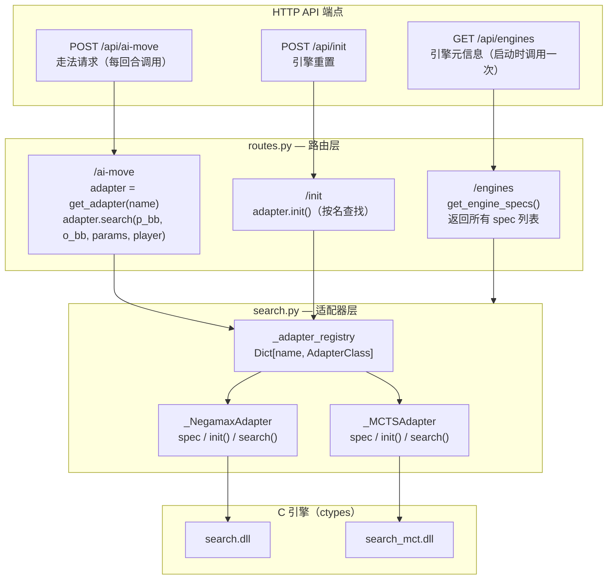
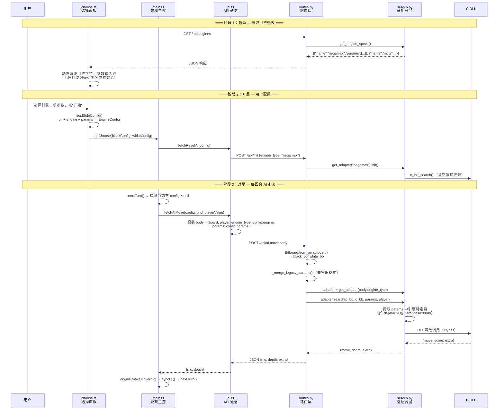

# 引擎注册机制架构设计（P1）

本文档记录 P1 重构的设计决策：**如何做到加一个 AI 引擎只需改一个文件**。

---

## 一、架构总览

```
                 ┌──────────────────────────────┐
                 │  GET /api/engines            │  ← 引擎元信息（启动时调用一次）
                 │  POST /api/ai-move           │  ← 走法请求（每回合调用）
                 │  POST /api/init              │  ← 引擎重置
                 └──────────┬───────────────────┘
                            │
          ┌─────────────────┼─────────────────┐
          ▼                 ▼                  ▼
   ┌──────────────┐  ┌──────────────┐  ┌──────────────┐
   │  routes.py   │  │  routes.py   │  │  routes.py   │
   │  /engines    │  │  /ai-move    │  │  /init       │
   │              │  │              │  │              │
   │ get_engine   │  │ adapter =    │  │ adapter.init()
   │ _specs()     │  │ get_adapter  │  │ (按名查找)
   │              │  │ (name)       │  │              │
   │ 返回所有     │  │              │  │              │
   │ spec 列表    │  │ adapter      │  │              │
   │              │  │ .search(     │  │              │
   │              │  │   p_bb,o_bb, │  │              │
   │              │  │   params,    │  │              │
   │              │  │   player)    │  │              │
   └──────┬───────┘  └──────┬───────┘  └──────┬───────┘
          │                 │                 │
          ▼                 ▼                 ▼
   ┌──────────────────────────────────────────────────┐
   │                search.py                         │
   │                                                  │
   │  _adapter_registry: Dict[str, AdapterClass]      │
   │                                                  │
   │  ┌─────────────────┐  ┌─────────────────┐        │
   │  │ _NegamaxAdapter │  │ _MCTSAdapter    │        │
   │  │                 │  │                 │        │
   │  │ spec   ← 元信息 │  │ spec            │        │
   │  │ init()          │  │ init()          │        │
   │  │ search()        │  │ search()        │        │
   │  └────────┬────────┘  └────────┬────────┘        │
   │           │                    │                 │
   │           ▼                    ▼                 │
   │   search.dll (ctypes)   search_mct.dll (ctypes)  │
   └──────────────────────────────────────────────────┘


---

## 二、接口契约

### 2.1 后端 Adapter 契约

每个引擎必须实现一个适配器类，满足以下三个约定：

| 约定项 | 类型 | 说明 |
|--------|------|------|
| `spec` | 类属性 `dict` | 引擎元信息（见 2.2） |
| `init()` | 类/静态方法，无参无返回 | 初始化引擎状态（每局开始前调用） |
| `search(p_bb, o_bb, params, player_value)` | 类/静态方法 | 执行搜索，返回 `(move, score, extra)` |

**`search()` 签名详解：**

```python
@staticmethod  # 或 @classmethod
def search(player_bb: int, opponent_bb: int,
           params: dict, player_value: int = 1
           ) -> Tuple[Optional[int], int, int]:
    """
    Parameters:
        player_bb    — 己方位棋盘（uint64）
        opponent_bb  — 对方位棋盘（uint64）
        params       — 自由键值对，适配器自行提取需要的键
                       {"depth": 14}、{"iterations": 20000} 等
        player_value — 1=黑方, -1=白方（前端原始值）

    Returns:
        move   — 棋盘索引 0-63，None 表示无合法走法
        score  — 评估分（正值=己方有利）
        extra  — 额外信息（限时搜索的 depth_reached，MCTS 的 iterations 等）
    """
```

**关键设计点：**
- `params` 是自由 dict，路由层不对其做任何假设，直接透传。适配器自行提取键、校验范围、决定默认值。
- `player_value` 始终是前端原始值（1/-1），适配器内部根据需要决定是否调换位棋盘（MCTS 需要，Negamax 不需要）。
- `extra` 的含义由各引擎自行定义，路由层只负责放入响应的 `depth` 字段回传给前端。

---

### 2.2 引擎元信息 schema（`spec`）

```python
spec = {
    "name": "negamax",                  # 引擎唯一标识（string）
    "label": "Negamax (Alpha-Beta)",    # 前端显示名（string）
    "params": [                         # 参数列表（有序，前端按序渲染）
        {
            "key": "depth",             # 参数键名（params dict 中的键）
            "type": "int",              # 控件类型："int" | "select"
            "default": 14,              # 默认值（int 或 string）
            "label": "搜索深度",         # 前端标签文本
            "min": 1,                   # 数值下界（type="int" 时可选）
            "max": 64,                  # 数值上界（type="int" 时可选）
        },
        {
            "key": "strategy",
            "type": "select",
            "options": [                # 下拉选项（type="select" 时必填）
                {"value": "fixed_depth", "label": "固定深度"},
                {"value": "time_limit",  "label": "限时搜索"},
            ],
            "label": "搜索模式",
        },
        {
            "key": "time_limit_ms",
            "type": "int",
            "default": 3000,
            "min": 10, "max": 600000,
            "label": "时间上限 (ms)",
            "show_if": {"strategy": "time_limit"},  # 条件显示（可选）
        },
    ],
}
```

**条件显示规则：** `show_if: {other_key: required_value}` 表示仅当同一侧表单中 `other_key` 参数的当前值等于 `required_value` 时，该参数行才可见。不满足时自动 `display: none`。

---

### 2.3 后端注册表 API

| 函数 | 签名 | 用途 |
|------|------|------|
| `get_adapter(name)` | `str → type｜None` | 按名称获取适配器类 |
| `get_engine_specs()` | `→ List[dict]` | 返回所有已注册引擎的 spec 列表 |

加新引擎只需要两步：

```python
# 1. 写 Adapter 类
class _MyAdapter:
    spec = { ... }
    @staticmethod
    def init(): ...
    @staticmethod
    def search(p_bb, o_bb, params, player): ...

# 2. 注册
_adapter_registry["myengine"] = _MyAdapter
```

**routes.py 不加任何代码。** 前端通过 `GET /api/engines` 自动感知，`/ai-move` 通过 `get_adapter(name)` 动态分发。

---

### 2.4 HTTP API 端点

| 端点 | 方法 | 请求体关键字段 | 响应 | 说明 |
|------|------|---------------|------|------|
| `/api/engines` | GET | — | `[EngineSpec, ...]` | 引擎列表 + 参数 schema |
| `/api/ai-move` | POST | `board`, `player`, `engine_type`, `params` | `{r, c, depth}` | 统一走法请求 |
| `/api/init` | POST | `engine_type?` | `{status, message}` | 重置引擎 |

**`/api/ai-move` 请求体：**

```json
{
  "board": [[0,0,0,...], ...],
  "player": 1,
  "engine_type": "negamax",
  "params": {
    "strategy": "fixed_depth",
    "depth": 14
  }
}
```

兼容旧格式：如果缺少 `params`，`depth` / `time_limit_ms` / `iterations` 依然可以作为顶层字段发送，路由层自动合并。

---

### 2.5 前端类型契约

```typescript
// 引擎配置（一份配置 = 一侧 AI 的全量信息）
interface EngineConfig {
  url: string;                          // API 地址
  engine: string;                       // 引擎名（对应后端 adapter name）
  params: Record<string, number | string>;  // 自由键值对
}

// 引擎元信息（GET /api/engines 响应 → 驱动整个选择面板）
interface EngineSpec {
  name: string;
  label: string;
  params: EngineParamSpec[];
}

interface EngineParamSpec {
  key: string;
  type: "int" | "select";
  default: number | string;
  label: string;
  min?: number;
  max?: number;
  options?: { value: string; label: string }[];
  show_if?: Record<string, string>;
}
```

**前端不包含任何引擎硬编码**——没有 `EngineType` 联合类型，没有 `if (engine === "negamax")` 分支，没有参数名常量。所有一切来自 `/api/engines` 响应。

---

## 三、数据流



**核心观察：** 在阶段 3 的整个链路中，`routes.py` 不知道 depth 是什么、iterations 是什么；`ai.ts` 不知道当前选的是 negamax 还是 mcts——它只是把 `config.params` 原样打包进 POST body。**两端的代码对新引擎完全透明。**

---

## 四、设计动机

### 4.1 重构前的痛点

| 痛点 | 具体表现 | 影响 |
|------|---------|------|
| **前后端重复声明** | 引擎名、参数名、默认值在 `search.py` / `routes.py` / `ai.ts` / `choose.ts` 四个文件各写一遍 | 加引擎 = 四份机械劳动，容易不一致 |
| **前端硬编码引擎类型** | `type EngineType = "negamax" \| "mcts"` | 加引擎必须改类型定义 |
| **前端硬编码参数 UI** | `makeParamHTML` 里 `if engineType === "negamax"` / `if engineType === "mcts"` | 每个引擎一段 if 分支 |
| **前端硬编码配置解析** | `readSideConfig` 里 `.negamax-strategy` / `.negamax-param` / `.mcts-param` | 每个引擎一套 class 名 + parsing |
| **路由硬编码 if-else** | `if engine_type == "mcts": ... elif request.time_limit_ms: ... else: ...` | 每个引擎一个分支，参数名散落在路由层 |
| **参数互斥无约束** | negamax 的 depth 和 time_limit_ms 同时显示 | 用户困惑：填了深度又填时间？ |

### 4.2 重构后

| 方面 | 效果 |
|------|------|
| **加新引擎** | 只改 `search.py`：写 Adapter 类 + 一行注册 |
| **前端** | 启动时 fetch `/api/engines`，面板、参数行、下拉选项全部动态生成 |
| **路由层** | `get_adapter(name).search(...)` 一行分发，与引擎数量无关 |
| **参数互斥** | `show_if` 字段声明式解决，前端自动隐藏不相关参数 |
| **一致性** | 参数名、默认值、范围约束的唯一定义点在 Adapter.spec |

### 4.3 如果不这样做

假设现在要加第三个引擎（比如 `edax`），保持旧架构的话：

```
旧架构（P1 之前）：
  search.py   ← 写 ~60 行 Adapter 类
  routes.py   ← 加 1 个 if 分支（约 6 行）
  ai.ts       ← 改 EngineType 联合类型（1 行）
                改 fetchAIMove body 组装（6 行）
  choose.ts   ← 加下拉 option（1 行）
                加参数 HTML 分支（8 行）
                加 readSideConfig 解析分支（5 行）
  合计：4 文件，~27 行机械代码 + ~60 行业务代码
```

```
新架构（P1 之后）：
  search.py   ← 写 ~50 行 Adapter 类（spec + init + search）
                加 1 行注册：_adapter_registry["edax"] = _EdaxAdapter
  合计：1 文件，~51 行，全部是业务代码
```

**差异不是行数，而是改了哪些文件。** 旧架构每次要触碰前端两个文件 + 路由层，这些地方本不该关心"引擎多了什么参数"。新架构中，`routes.py` 不知道参数名，`ai.ts` 不知道引擎名，`choose.ts` 不知道渲染的是谁的 UI——每一层只守自己的边界。

### 4.4 设计模式

本质上是两个经典模式的组合：

| 模式 | 应用位置 | 作用 |
|------|---------|------|
| **注册表模式** | `_adapter_registry: Dict[name, class]` | 解耦名称→行为的映射，消除 switch/if-else |
| **契约式设计** | `Adapter.spec` + `Adapter.search()` | 每层只依赖接口，不依赖具体类。后端只认 `search(p_bb, o_bb, params, player)` 这个签名，前端只认 `spec` 的 JSON schema |

不需要完整的插件系统（动态发现、热加载、沙箱隔离），一个 dict 就够了——**刚好够用的抽象**。

---

## 五、相关文件

| 文件 | 角色 |
|------|------|
| `backend/ai/search.py` | 适配器注册表 + 所有 Adapter 实现 |
| `backend/api/routes.py` | HTTP 端点（引擎列表 + 动态分发） |
| `backend/core/board.py` | Bitboard 工具类（2D↔位棋盘转换、走法生成） |
| `frontend/src/api/ai.ts` | EngineConfig / EngineSpec 类型 + fetchAIMove / fetchResetAI |
| `frontend/src/ui/choose.ts` | 动态渲染引擎选择面板（fetch /api/engines → 生成 UI） |
| `frontend/src/main.ts` | 游戏主控：持有 EngineConfig，调用 fetchAIMove / fetchResetAI |
| `frontend/src/core/game.ts` | 前端棋盘逻辑（走法校验、翻转、计分） |
| `docs/adding-ai-engine.md` | 新引擎接入操作指南 |
| `docs/backlog.md` | 项目代办（P1 已勾选完成） |
